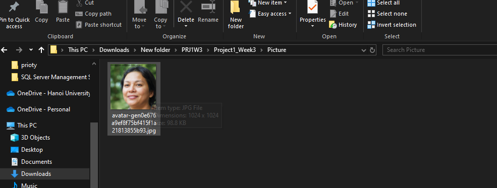

# Project1_Week3
# Crawl ảnh bằng chương trình python trên trang web https://this-person-does-not-exist.com/ bẳng việc sử dụng các thư viện os, requests, BeautifulSoup
## Tải các thư viện bằng lệnh pip install thư-viện trên ngay terminal
## Tạo một folder có đường dẫn giống trong code để tải ảnh về
## Viết chương trình và chạy 
# Kết quả:
